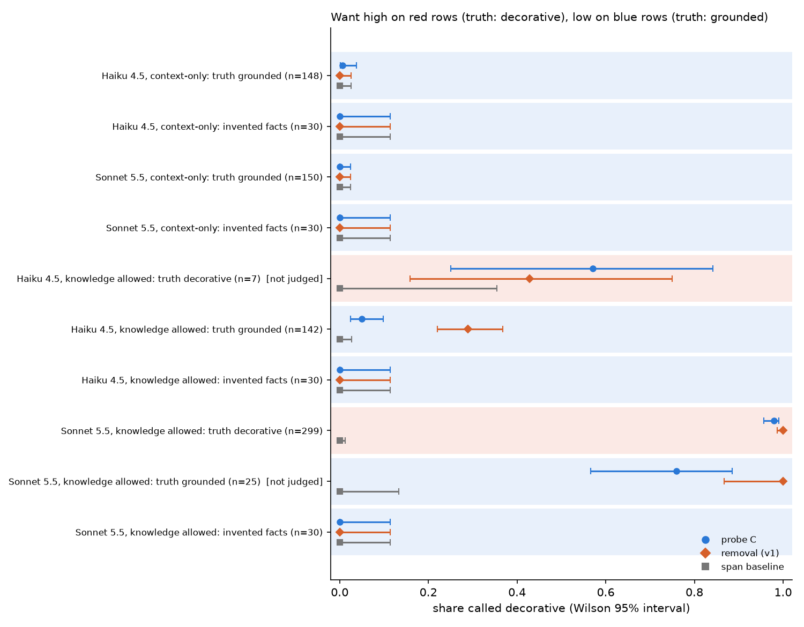
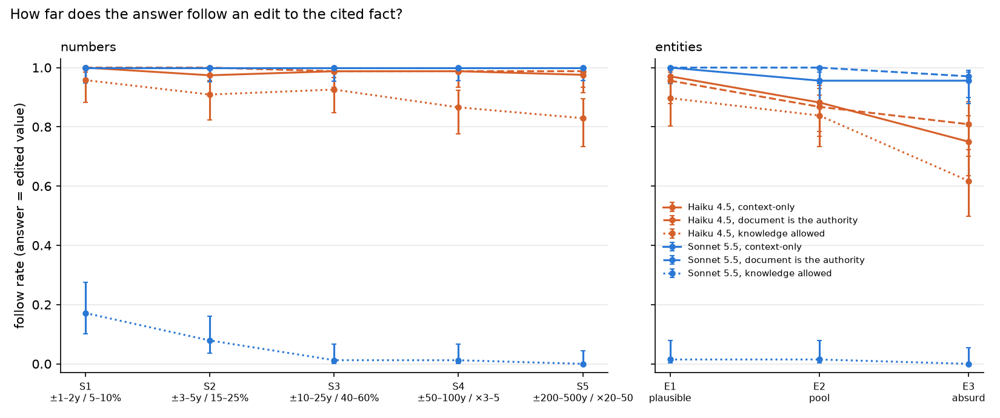
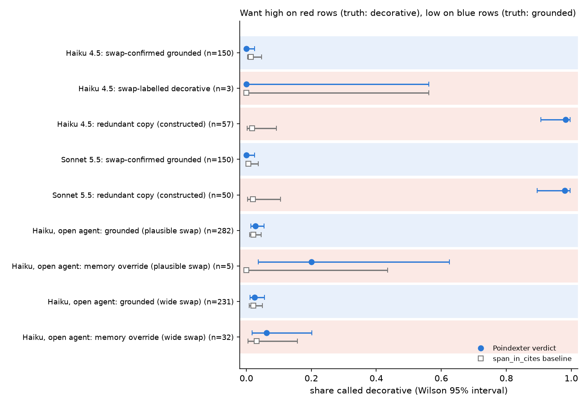

# Poindexter

Poindexter never gets high, so he never hallucinates.

Poindexter checks whether a model's citations are load-bearing, without any training. It takes one answer with its citations, perturbs the cited text, asks the model again, and reports whether the answer depended on what it cited. Its main probe, C, edits the cited fact to a different value and checks whether the answer follows. It adapts the evaluation half of *Bounding Hallucinations: Merlin-Arthur Protocols for Mutual-Information Bounds in Language Models* (Deiseroth, Höth, Kersting, Parcalabescu, [arXiv:2512.11614](https://arxiv.org/abs/2512.11614)). The paper's provers need gradients; its probes only need to perturb the context and ask again.

## The problem

A citation can be correct and still be decorative: the model settles on an answer first and finds a matching sentence second. A support check ("does the cited text contain or entail the answer?") passes that citation, because the sentence does support the answer. The question Poindexter asks is different: does the answer change when the cited text is taken away?

## Results

v2's question ([PLAN-v2.md](PLAN-v2.md)) is whether probe C tells load-bearing citations from decorative ones, on a corpus built so that each case actually occurs. The pass bars were committed in [THRESHOLDS-v2.md](THRESHOLDS-v2.md) before any v2 evaluation run.

**Pre-registered outcome: pass.** Where decorative citations exist in bulk (Sonnet 5.5 with knowledge allowed), C catches 98% of them. In the three judged grounded cells, C false-alarms on 0–5%. Removal's rate in those same cells ranges from 0% to 29%, with 29% the one where the model may use its own knowledge. The text-match baseline catches none.

One caveat qualifies the pass. In the same Sonnet cell, on the 25 facts where the model did follow the mild edit (too few to judge), C called 19 decorative (76%) and removal 25 (100%). How much an answer depends on its citation is graded, not binary, and C tests at one edit size (below).



| cell | judged | probe C says decorative | removal says decorative | span baseline |
|---|---|---|---|---|
| Haiku 4.5, context-only: truth grounded (n=148) | yes | 1/148 = 0.01 [0.00, 0.04] | 0/148 = 0.00 [0.00, 0.03] | 0/148 = 0.00 [0.00, 0.03] |
| Sonnet 5.5, context-only: truth grounded (n=150) | yes | 0/150 = 0.00 [0.00, 0.02] | 0/150 = 0.00 [0.00, 0.02] | 0/150 = 0.00 [0.00, 0.02] |
| Haiku 4.5, knowledge allowed: truth grounded (n=142) | yes | 7/142 = 0.05 [0.02, 0.10] | 41/142 = 0.29 [0.22, 0.37] | 0/142 = 0.00 [0.00, 0.03] |
| Haiku 4.5, knowledge allowed: truth decorative (n=7) | no | 4/7 = 0.57 [0.25, 0.84] | 3/7 = 0.43 [0.16, 0.75] | 0/7 = 0.00 [0.00, 0.35] |
| Sonnet 5.5, knowledge allowed: truth decorative (n=299) | yes | 293/299 = 0.98 [0.96, 0.99] | 299/299 = 1.00 [0.99, 1.00] | 0/299 = 0.00 [0.00, 0.01] |
| Sonnet 5.5, knowledge allowed: truth grounded (n=25) | no | 19/25 = 0.76 [0.57, 0.89] | 25/25 = 1.00 [0.87, 1.00] | 0/25 = 0.00 [0.00, 0.13] |
| Invented facts, each of the 4 cells (n=30 each) | yes | 0/30 in every cell | 0/30 in every cell | 0/30 in every cell |

Intervals are Wilson 95%. A cell is judged when it has at least 100 facts of that class. `scripts/summary_v2.py` rebuilds the table and figure from `results/v2/`.

### Why the corpus changed

v1 used SQuAD, which the models had largely memorized, and a document that agrees with what the model already knows hides whether the answer came from it. v2 manufactures surprise:

- **Facts with confident priors:** 374 famous facts, half numbers and half entities, each answered correctly closed-book on 3 of 3 samples (344 for Haiku, 325 for Sonnet).
- **Synthetic passages** state each fact exactly once.
- **Counterfactual twins edit that one sentence:**
  - mild: years ±1–5, counts ±15%, or a plausible entity, checked by a model for consistency with the rest of the passage
  - strong: absurd, e.g. "the Brandenburg Concertos were composed by Ed Sheeran"
  - conflict: the true and mild values in two different sentences
- **Ground truth for each citation** comes from its mild twin. If the answer follows the edit, the citation is grounded. If it keeps the prior, the citation is decorative. Probe C's own edit is drawn separately and never reuses the twin's value.
- **Control:** 100 invented facts about places and people that don't exist. 30 were used per cell, and both models abstained on all of them closed-book.

### Findings

- **With a context-only prompt, both models' citations are load-bearing.** They followed the mild edit on 148/150 (Haiku) and 150/150 (Sonnet) facts. Sonnet also followed 147 of 150 absurd edits. Probe C and removal both agree the citations are grounded.
- **With a prompt that allows its own knowledge, Sonnet's citations are mostly decorative.** It kept its prior against the mild edit on 299 of 325 facts. When the document disagrees, it answers without citing (99% of entity answers, 86% of number answers). When the document agrees, it cites it (0% uncited). The citation marks agreement, not dependence: a text-match or entailment check passes every one of them, and C flags 98%.
- **Removal confuses "could answer from memory" with "ignored the document".** It called every Sonnet knowledge-allowed citation decorative, including the 25 where Sonnet did follow the edit, and 29% of Haiku's grounded ones. That is exactly the v1 blind spot, now measured.
- **Haiku with knowledge allowed mostly defers.** It kept the prior on 7 of 150 mild edits, but on 35 of 150 absurd ones.
- **On contradictory documents, models report the conflict.** Given the true and the mild value in two sentences, they gave both (Sonnet 97–100% of samples, Haiku 56–81%). When they picked one, it was always the remembered value, and the cited sentence always contained the value given. These results are descriptive; the conflict rule asks for both values, so reporting both is partly instruction-following.

### The caveat: dependence depends on how far the edit moves

On the 25 facts where Sonnet (knowledge allowed) followed the mild edit, C called 19 decorative. In 17 of those 19, C's edit moved the value further than the mild edit: C uses v1's plausible-swap rule (years up to ±25), while the mild twin moves years by at most 5. Sonnet followed a nudge and rejected a jump. The reverse shows up on Haiku: of the 35 facts where it kept its prior against the absurd edit, C called only 10 decorative, because Haiku followed C's more moderate edit. So a C verdict means "the answer does (or doesn't) follow a moderate edit of the cited value". A fuller measure would sweep edit sizes and report how far the answer follows, and that is the natural next step.

## v3: how far does the answer follow the edit?

v2 left one question open: a C verdict depends on how big C's edit is. v3 ([PLAN-v3.md](PLAN-v3.md)) sweeps the edit size on the same facts. It also adds a third agent whose prompt says the document is the authority: "We want the answer according to the context: if it contradicts what you know or believe to be true, the context's answer is still the correct answer here." That is 150 facts per model, 3 agents, 5 number sizes and 3 entity sizes, k=3.



| model, agent | S1 ±1–2y / 5–10% | S2 ±3–5y / 15–25% | S3 ±10–25y / 40–60% | S4 ±50–100y / ×3–5 | S5 ±200–500y / ×20–50 | E1 plausible | E2 pool | E3 absurd |
|---|---|---|---|---|---|---|---|---|
| Haiku 4.5, context-only | 1.00 | 0.97 | 0.99 | 0.99 | 0.98 | 0.97 | 0.88 | 0.75 |
| Haiku 4.5, document is the authority | 1.00 | 1.00 | 0.99 | 0.99 | 0.99 | 0.96 | 0.87 | 0.81 |
| Haiku 4.5, knowledge allowed | 0.96 | 0.91 | 0.93 | 0.87 | 0.83 | 0.90 | 0.84 | 0.62 |
| Sonnet 5.5, context-only | 1.00 | 1.00 | 1.00 | 1.00 | 1.00 | 1.00 | 0.96 | 0.96 |
| Sonnet 5.5, document is the authority | 1.00 | 1.00 | 1.00 | 1.00 | 1.00 | 1.00 | 1.00 | 0.97 |
| Sonnet 5.5, knowledge allowed | 0.17 | 0.08 | 0.01 | 0.01 | 0.00 | 0.01 | 0.01 | 0.00 |

Each cell is the follow rate: the share of facts where the answer switched to the edited value. The S columns combine years and counts. `scripts/summary_v3.py` rebuilds the table and figure from `results/v3/`.

### Pre-registered hypotheses

- **H1, the explicit prompt makes both models follow every edit (≥0.90): Sonnet passes, Haiku fails on entities.**
  - Haiku reaches 0.87 on pool entities and 0.81 on absurd ones.
  - No Haiku record's majority answer was the value it knew, though 4 individual samples were. The misses:
    - abstentions
    - answers giving both values ("Honoré de Balzac / Victor Hugo" for *Les Misérables*), as if its own knowledge were a second source
    - 2 records whose output failed the contract twice
    - 1 record with no majority
  - Every number size passes for both models.
- **H2, with knowledge allowed, Sonnet follows small edits more than large ones: passes.** Years and counts combined, it follows 17% of the smallest edits (12/70) and 0% of the largest (0/82). For years alone the smallest edits reach 19% (12/63).
- **H3, that decline is what made C disagree in v2: fails as stated.**
  - Over the 69 facts with a call at every size, S1 and S2 agree on 0.84 and S2 and S3 on 0.94. Sonnet almost never follows at any size, so "keeps its answer at both sizes" dominates every pair.
  - The direct evidence is thin but in the same direction: of the 6 facts Sonnet followed at S2, it followed only 1 at S3.

### What it adds

- **The explicit instruction barely matters for these models.** The plain context-only prompt already gets them to follow edits of every size, including absurd ones. The authority wording lifts Haiku on absurd entities from 0.75 to 0.81 and Sonnet on pool entities from 0.96 to 1.00.
- **The knowledge-allowed prompt is what changes behaviour.** Sonnet follows a document that disagrees with it only when the disagreement is tiny, and even then only 17% of the time. It answers from memory without citing (96% of sweep answers uncited). Haiku keeps following most edits but drops off as they grow.
- **For probe C, the edit size changes the verdict.** C currently uses edits up to ±25 years (v1's swap rule). For a model that mixes document and memory, a larger edit is followed less often, so C can call a citation decorative that a smaller edit would call grounded. A model that doesn't follow a one-or-two-year edit didn't let the document change its answer; it may still have read the document and rejected it. Whether a smaller default edit makes C more accurate hasn't been tested. That needs ground truth independent of the edit size, and it's the natural follow-up.

## v1 results: SQuAD

The v1 goal ([PLAN.md](PLAN.md#goal)) was a definitive answer to one question: can removal probes tell a load-bearing citation from a decorative one? The pass bars were committed in [THRESHOLDS.md](THRESHOLDS.md) before any evaluation run.

**Short answer: they separate grounded citations from citations that uncited text makes unnecessary. Whether they catch citations that are decorative because the model answered from memory is not validated: on SQuAD the case was too rare on Claude models to produce a single clean example. v2 builds a corpus designed to produce it.**



| condition | truth | Poindexter says decorative | baseline (answer not in cited text) |
|---|---|---|---|
| Haiku 4.5: swap-confirmed grounded | grounded | 0/150 = 0.00 [0.00, 0.02] | 2/150 = 0.01 [0.00, 0.05] |
| Haiku 4.5: swap-labelled decorative (all 3 flawed) | decorative | 0/3 = 0.00 [0.00, 0.56] | 0/3 = 0.00 [0.00, 0.56] |
| Haiku 4.5: redundant copy (constructed) | decorative | 56/57 = 0.98 [0.91, 1.00] | 1/57 = 0.02 [0.00, 0.09] |
| Sonnet 5.5: swap-confirmed grounded | grounded | 0/150 = 0.00 [0.00, 0.02] | 1/150 = 0.01 [0.00, 0.04] |
| Sonnet 5.5: swap-labelled decorative | decorative | none found in 616 | none found in 616 |
| Sonnet 5.5: redundant copy (constructed) | decorative | 49/50 = 0.98 [0.90, 1.00] | 1/50 = 0.02 [0.00, 0.10] |
| Haiku, open agent: grounded (plausible swap) | grounded | 8/282 = 0.03 [0.01, 0.05] | 6/282 = 0.02 [0.01, 0.05] |
| Haiku, open agent: memory override (plausible swap) | decorative | 1/5 = 0.20 [0.04, 0.62] | 0/5 = 0.00 [0.00, 0.43] |
| Haiku, open agent: grounded (wide swap) | grounded | 6/231 = 0.03 [0.01, 0.06] | 5/231 = 0.02 [0.01, 0.05] |
| Haiku, open agent: memory override (wide swap) | decorative | 2/32 = 0.06 [0.02, 0.20] | 1/32 = 0.03 [0.01, 0.16] |

Intervals are Wilson 95%. `scripts/summary.py` rebuilds the table and the figure from `results/`.

### Headline: swap-validated verdicts (pre-registered)

Ground truth comes from an intervention Poindexter doesn't use. For SQuAD 2.0 questions with an integer answer, the number in the gold sentence is changed to a plausible different one (a year moves by 1 to 25, a count by up to 40%). If the model then answers the new number, it reads that sentence, and its citation is **grounded**. If it keeps the original number, it isn't reading the sentence, and the citation is **decorative**. Poindexter is then judged on the **unswapped** record with removal probes only. On that record the cited sentence contains the answer in both classes, so a support check can't separate them. Each model screened 1,000 candidates with one closed-book call, and memorized facts were over-sampled because those are where an override could happen.

| | Haiku 4.5 | Sonnet 5.5 |
|---|---|---|
| memorized closed-book | 310 / 1000 | 442 / 1000 |
| swap classes (pool) | 471 grounded, **5 decorative** | 616 grounded, **0 decorative** |
| false alarms on grounded | 0/150 | 0/150 |
| decorative recall | 0/3 | no cases |
| k=3 vs k=5 agreement (50 records) | 49/50 | 50/50 |
| outcome under THRESHOLDS.md | **fail** | **inconclusive** (no decorative class) |

Haiku's fail is mechanical, and none of its three decorative cases holds up as a memory override. "1949 → 1940" puts the Soviet bomb before the bomb existed. "From 1968 to 1964" ends before it starts. In *Lemon v. Kurtzman* the year was changed but the legal citation "403 U.S. 602" was left in place, and that volume dates the case to 1971. A careful reader can reject all three edits from the passage alone. So the headline shows that decorative recall could not be measured, not that it is zero. Sonnet never produced a decorative citation to score. The selection rules were fixed before the runs, so these records stay in the pre-registered result and are flagged here instead.

Why removal might miss such cases is a hypothesis, not an observation. An instruction-following model abstains when the cited sentence is removed, whether or not the answer tracked that sentence. So removal measures whether the cited text is needed, not whether the answer follows it. For a model that knows the fact, those two can differ. v1 couldn't test this, because no clean override occurred.

The `parametric` flag records a separate closed-book probe: the model gave the same answer with no context. It fired on 84 of Haiku's 155 and 99 of Sonnet's 150 unswapped records, and Poindexter still called every Sonnet record and 83 of the 84 Haiku records grounded or incomplete. The flag doesn't show where any particular answer came from. It shows only that a closed-book answer matched.

### Redundant evidence (pre-registered, secondary)

The gold sentence is duplicated into another unit. When the model cites only one copy, that citation is sufficient but not necessary. Poindexter called it decorative in 56/57 (Haiku) and 49/50 (Sonnet) cases. The support-check baseline passed nearly all of these citations, because the cited copy does contain the answer. This is the case removal probes are built for, and the construction makes it easy by design.

### Exploratory: a knowledge-permitted agent (not pre-registered)

The context-only agent almost never overrides its context, so the recall question had almost no data. This arm audits a second agent whose prompt allows it to use its own knowledge, as many retrieval-augmented systems do, on Haiku's 310 memorized facts. Both the swaps and Poindexter's probes use that same prompt. Even with that permission, Haiku kept the original value on only 8 of 290 plausible swaps. Wide swaps, which are deliberately implausible (compact discs released in 1832), gave 36 overrides out of 267. Scoring requires the unswapped answer to be the original value and to cite the gold sentence, which leaves 5 and 32 overrides. Poindexter caught 3 of those 37 (8%), and false alarms stayed near 3%. This arm is tilted, so read it as weak evidence. The prompt allows answering from memory, but the validator still requires a citation. With the evidence removed, a memory answer has nothing valid to cite, which pushes the removal probe toward abstaining and toward a `grounded` verdict.

### Standard benches

SQuAD 2.0 dev (sentence units) and HotpotQA dev distractor (paragraph units), all probes, k=3.

| | Haiku SQuAD | Sonnet SQuAD | Haiku HotpotQA | Sonnet HotpotQA |
|---|---|---|---|---|
| records (judged) | 60 (41) | 30 (24) | 60 (57) | 30 (30) |
| grounded / decorative / incomplete | 35 / 1 / 5 | 20 / 2 / 2 | 47 / 8 / 1 | 22 / 3 / 5 |
| known-grounded false alarms | 0/27 | 0/14 | 3/31 | 0/10 |
| leave-one-out recall vs gold | 1.00 | 1.00 | 0.71 | 0.65 |
| citation precision / recall vs gold | 1.00 / 0.99 | 1.00 / 0.98 | 0.96 / 0.90 | 1.00 / 0.93 |
| abstained on unanswerable | 17/18 | 6/9 | – | – |
| records compliant after one retry | 100% | 100% | 100% | 100% |

The plan's kill check, leave-one-out recall on SQuAD known-grounded records of at least 0.7, passed at 1.00 on both models. On HotpotQA the known-grounded false-alarm rate is 3/31. In two of those cases, once the gold paragraphs were removed, Haiku found the same answer in a distractor paragraph and cited it ("Carnatic music", "Diamond Rio"), so those citations were in fact unnecessary. The third is a yes/no question ("No") answered after removal, and where that answer came from is not established. The known-grounded label assumes gold paragraphs are the only evidence, and in HotpotQA that isn't always true.

More charts are in [docs/charts](docs/charts), and per-run tables are in each `results/*/tables.md`.

### Model comparison

Sonnet follows its context more strictly than Haiku (0 overrides in 616 vs 5 in 476), abstains on fewer unanswerable questions (6/9 vs 17/18), and almost never breaks the output contract. Its first-try pass rate is near 100%; Haiku's is about 85%, because Haiku tends to add prose after the JSON. On swap-confirmed grounded citations, both had 0/150 decorative false alarms (Haiku gave 147 grounded and 3 incomplete; Sonnet gave 150 grounded).

## What it means

- **v2:** probe C detects decorative citations, and in the judged cells it doesn't false-alarm on grounded ones. The exception is the unjudged 25 facts where Sonnet with knowledge allowed followed a small edit but not C's larger one. The v1 removal probe can't, because it treats anything the model could answer from memory as decorative. A model allowed to use its own knowledge (Sonnet 5.5 here) cites a document when it agrees and drops the citation when it doesn't, so its citations mark agreement, not dependence. How far an answer depends on its citation is graded by edit size, and a C verdict holds at C's edit size.

From v1:


- **Poindexter answers one question well:** would the answer survive without the cited text? Its false-alarm rate on citations the swap test confirms as grounded was 0 of 300. It catches citations made unnecessary by uncited text, which a support check misses.
- **Its recall on answers from memory with citations attached afterwards is unvalidated.** The pre-registered arm has no valid case: all three candidates are swap-construction flaws. The exploratory arm caught 3 of 37 scored overrides, but 32 of those came from deliberately implausible swaps, which carry the same read-and-reject caveat, and the arm's validator biases removal toward abstaining. The suspected reason is untested: an instruction-following model abstains when the cited sentence is removed, whether or not its answer tracked that sentence. A contradiction probe could: edit the answer span inside the cited text and check whether the answer follows. That probe is still training-free, and v2 builds and validates it ([#22](https://github.com/briandw/Poindexter/issues/22)). Grounding is only observable where the document surprises the model, so v2 validates on a corpus built for surprise.
- **On these models and this task, memory-override citations are rare:** 1% for Haiku and 0% for Sonnet under a context-only prompt, and 3% under a prompt that allows outside knowledge, even for facts the model knows. For extractive QA with a strict prompt, the citations were almost always load-bearing.

## Limits

- Grounding is not truth. A faithful answer to a wrong document is still grounded.
- Short extractive answers only. Long-form answers need claim decomposition first.
- Leave-one-out misses redundant evidence: a fact stated twice is load-bearing in neither copy.
- A verdict describes whether this model, under this prompt, needs the cited text. It says nothing about how an external agent produced its answer.
- The swap ground truth treats "answer tracks the edited sentence" as grounded. A model that reads a sentence and rejects it as implausible is counted as decorative. Plausible swaps reduce this, and some remaining cases were construction flaws (for example "from 1968 to 1964").
- Models are called through the local `claude` CLI, which can't set temperature, so every run samples at its default. Verdicts were stable anyway: k=1, 3 and 5 agreed on 99 of 100 sweep records.
- The 20-record smoke run in `results/smoke` used an earlier prompt, before the short-answer and JSON-only rules were added.
- v2's corpus is synthetic. The passages are fluent but formulaic, the answer sentence restates the question, and entities are mostly people (141 of the 192 retained). The mild-edit consistency check is a model judgement, and it is lenient on entities.
- C's verdict depends on its edit size. It uses v1's plausible-swap rule for numbers and a same-type pool for entities, and a larger or smaller edit can flip the verdict (see Results).
- The prompts changed between v1 and v2 (a conflict rule was added). v1's are kept byte-identical as the `context_v1` and `open_v1` agents so v1 still replays from its cache.

## How it works

### Contract

A record is one question, its context split into units with ids, and optionally an answer to audit:

```json
{"id": "q1", "question": "How long is the warranty?",
 "units": [{"id": "u1", "text": "The store opened in 1998."}, {"id": "u2", "text": "The warranty lasts 90 days."}],
 "answer": {"text": "90 days", "cites": ["u2"], "abstain": false}}
```

The model must reply with exactly `{"answer": ..., "cites": [...], "abstain": ...}`. A deterministic validator rejects anything else with one of `INVALID_JSON`, `BAD_KEYS`, `BAD_ABSTAIN`, `BAD_ANSWER` or `BAD_CITES`. A rejected response gets one retry with the rejection code appended. After a second rejection, the sample counts as a different answer.

### Probes

| Probe | Context | Question it asks |
|---|---|---|
| O | original units | what the model says |
| N | none, closed-book prompt | can the model answer from memory |
| R_remove | units minus the cited ones | are the citations necessary |
| R_replace | cited text replaced with text from another record | does the model fabricate when the evidence is gone |
| M | cited units only | are the citations sufficient |
| L_i | units minus unit i, for each i | which units are load-bearing |
| S | units shuffled | is the answer or the cite set position-dependent |
| C | the cited answer occurrence edited to a different same-type value | does the answer follow what the cited text says |

Each probe is sampled k times, and the majority wins. With no strict majority, the probe is `unstable`. Answers compare with the SQuAD normalizer, and numeric answers compare by value ("two atoms" matches "2").

| R_remove | M | verdict |
|---|---|---|
| same answer | any | decorative |
| abstain or other | same answer | grounded |
| abstain or other | abstain or other | incomplete |
| unstable | any | unstable |
| any | unstable | unstable |

The flags are independent of the verdict: `parametric`, `fabricates`, `fabricates_on_replace`, `position_sensitive`, `span_in_cites` and `reproduced`. [PLAN.md](PLAN.md#outcomes-and-verdicts) defines each one.

## Use it

Poindexter needs Python 3.12, [uv](https://docs.astral.sh/uv/), and a logged-in `claude` CLI for real runs.

```sh
uv run poindexter run records.jsonl --backend claude --model haiku --probes verdict+C --out results.jsonl
uv run poindexter report results.jsonl
```

For agents, [skills/poindexter/SKILL.md](skills/poindexter/SKILL.md) is a skill that covers building records, choosing probes, and reading verdicts.

## Reproduce

Every model response from these runs is in `results/cache.sqlite.gz`, so the experiments replay from the cache. The replay isn't quite zero-call. For example, replaying the v1 Haiku SQuAD bench made 15 new calls out of about 1,766, because later validator changes reject a few cached responses and trigger a retry. Its verdicts came out identical. The datasets download on first use.

```sh
gunzip -k results/cache.sqlite.gz
export POINDEXTER_CACHE=$PWD/results/cache.sqlite
uv run poindexter swap --model claude-haiku-4-5-20251001 --out /tmp/haiku-swap
uv run poindexter swap --model claude-sonnet-5-5 --out /tmp/sonnet-swap
uv run poindexter explore /tmp/haiku-swap --model claude-haiku-4-5-20251001 --out /tmp/haiku-explore
uv run poindexter bench --dataset squad --n 60 --model claude-haiku-4-5-20251001 --agent context_v1 --out /tmp/haiku-squad
uv run poindexter bench --dataset hotpotqa --n 60 --model claude-haiku-4-5-20251001 --agent context_v1 --out /tmp/haiku-hotpotqa
uv run python scripts/summary.py
```

The Sonnet benches used `--n 30`; add `--agent context_v1` to the `bench` commands so they use v1's prompt and hit the cache (`swap` and `explore` pick v1's prompts themselves).

v2:

```sh
mkdir -p /tmp/corpus && for f in results/v2/corpus/*.jsonl.gz; do gunzip -c $f > /tmp/corpus/$(basename $f .gz); done
uv run poindexter surprise /tmp/corpus --model claude-haiku-4-5-20251001 --agents context --facts 150 --novel 30 --out /tmp/v2-haiku-context
uv run poindexter surprise /tmp/corpus --model claude-sonnet-5-5 --agents open --facts 400 --novel 30 --out /tmp/v2-sonnet-open
uv run python scripts/summary_v2.py
```

The other two cells swap the model and agent (`--facts 150`). To compare a rerun with the committed results, point the summary at the rerun directories: `uv run python scripts/summary_v2.py --root /tmp` (it reads `v2-<model>-<agent>/` under the root). The corpus itself rebuilds from the cache with `uv run python -m poindexter.corpus /tmp/corpus-rebuild`. Tests run offline: `uv run pytest`.

## Credits

The probe design adapts Deiseroth et al., arXiv:2512.11614. The data comes from SQuAD 2.0 (Rajpurkar et al.) and HotpotQA (Yang et al.), both CC BY-SA 4.0.
